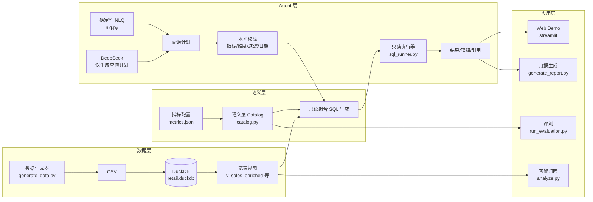
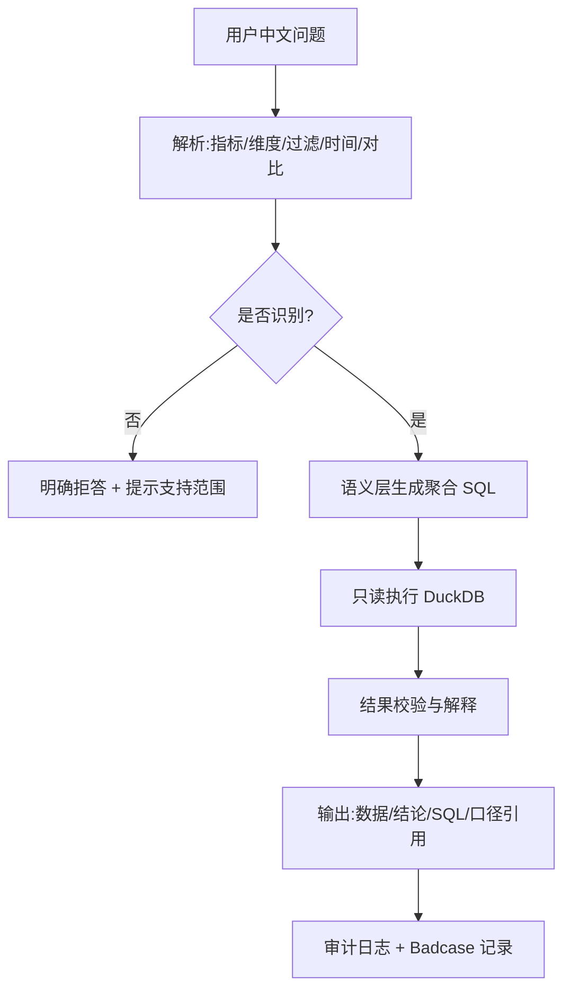

# 零售经营分析 Data Agent（优选生活）

> 用中文直接提问经营问题，系统返回**可追溯、可审计、可复用**的分析结果：解析口径 → 生成 SQL → 只读查询 → 结论与引用来源，全程无需人工写 SQL。

面向用户：**门店与区域经营负责人、商品/渠道运营、数据分析师**，以及想要学习「AI Agent + 数据仓库 + 语义层」工程落地的开发者。

项目状态：**本地可运行 MVP **。当前使用虚拟数据，重点展示 Data Agent 的语义建模、质量治理和交付闭环。

---

## 一、效果速览

### 最小体验（30 秒）

```bash
python3 -m venv .venv
source .venv/bin/activate
pip install -r requirements.txt
python3 scripts/generate_data.py
python3 scripts/init_db.py
python3 scripts/smoke_query.py     # 验证语义层聚合查询可生成并执行
python3 scripts/run_evaluation.py  # 查看评测通过率
```

### 效果示例：智能经营月报（真实产物）

以下为 `reports/2025-11-east.md` 的报告摘要，完整内容见该文件。报告中的数字、预警和归因可由确定性逻辑复现；如果使用 `--llm`，文字表达可能随模型输出变化。

```text
# 优选生活 经营分析月报（2025-11 · 华东）

## 核心指标
| 指标 | 2025-11 | 2025-10 | 变化率 |
|------|---------|---------|--------|
| 销售额 | 1,371,235.35 元 | 1,846,695.27 元 | -25.75% |
| 订单数 | 19,971 单 | 26,948 单 | -25.89% |
| 毛利额 | 325,583.15 元 | 438,529.27 元 | -25.76% |
| 客单价 | 68.66 元 | 68.53 元 | +0.19% |

## 异常预警
华东区域销售额在 2025-11 触发高严重度预警：当前值 1,371,235.35 元，
较前 3 个月平均销售额 1,860,750.19 元下降 26.31%
（规则：较前 3 个月平均销售额下降超 15% 即触发）。

## 销售变化归因（按门店，2025-10 → 2025-11）
| 门店 | 下降额 | 对总下降的贡献率 |
|------|--------|------------------|
| 上海旗舰店1店 | -130,919.51 元 | 27.54% |
| 上海标准店2店 | -120,485.31 元 | 25.34% |
| 杭州旗舰店3店 | -116,973.94 元 | 24.60% |
| 杭州标准店4店 | -107,081.16 元 | 22.52% |
```

### 效果示例：中文问数（输入 → 处理 → 输出）

```text
问：华东区域 2025 年 11 月的销售额，与去年同期对比

系统处理：
  1. 解析：指标=销售额，维度=区域，过滤=华东，时间=2025-11，对比=同比
  2. 语义层生成聚合 SQL（口径来自 configs/metrics/metrics.json）
  3. 只读执行 DuckDB，返回当前值/对比值/变化额/变化率

输出：当前值、去年同期值、变化额、变化率
解释：销售额在2025年11月按区域分析（区域=华东），已返回当前值、对比值、变化额和变化率。
引用：指标口径、维度取值、生成 SQL 一并展示，可人工复核
```

> 注：以上数字为固定种子生成的虚拟数据产物，可在本地复现核对；所有结果均可在运行时核对 SQL 与口径。

---

## 二、业务背景与痛点

区域/门店经营者每天都在问同样的问题：

- 「这个月华东为什么下滑了？是哪个品类、哪家店拖累的？」
- 「上个月渠道订单数为什么涨了？同比增长多少？」
- 要回答这些问题，通常需要数据分析师写 SQL、对数、画图表，一问一答往往以小时计。

现有方式的问题：

| 问题 | 说明 |
| --- | --- |
| 门槛高 | 业务人员不会 SQL，依赖分析师排期 |
| 口径不统一 | 同一指标在报表、取数、汇报中定义可能不一致 |
| 不可追溯 | 手工取数的结论难以复核，改了哪里说不清 |
| 响应慢 | 一次取数 + 人工核对通常需要 30 分钟到数小时 |

---

## 三、解决方案与核心价值

本项目提供一个**可本地运行、可评测、可审计**的零售经营分析 Agent 演示：

1. **中文自然语言问数**：业务人员直接提问，无需 SQL
2. **指标口径单一来源**：所有指标在 `configs/metrics/metrics.json` 定义，全链路复用同一口径
3. **可追溯**：每个回答都输出「解析结果 → 生成 SQL → 数据 → 解释 → 口径引用」，可逐层复核
4. **可评测**：内置 Golden 数据集与评测脚本，通过率可重复验证，Prompt/规则改动有回退依据
5. **端到端闭环**：虚拟数据生成 → 数仓建模 → 问数 → 预警归因 → 月报 → 评测，覆盖 Agent 全链路

### 关键价值指标（口径可验证）

| 指标 | 数值 | 口径 |
| --- | --- | --- |
| 数据规模 | 2024-01-01 ～ 2025-12-31 两个完整年度 | 生成器按代码计算：731 天 × 16 门店 × 48 商品 × 4 渠道 ≈ 225 万行日销售明细 |
| 指标覆盖 | 7 个核心指标 | 销售额、订单数、毛利额、毛利率、客单价、库存金额、客流量 |
| 评测集 | 6 个 Golden 用例 | `configs/evaluation/golden_questions.json`，覆盖同比、维度分组、多期趋势、渠道/品类维度、渠道过滤等场景 |
| 结果可复现 | 固定随机种子（SEED=20250806） | 每次生成数据一致，预警/归因/报告可复现 |
| 安全 | SQL 只读执行 | 底层 DuckDB 以 read-only 模式打开 |

> 说明：通过率等运行期指标请以本地 `python3 scripts/run_evaluation.py` 输出为准，本 README 不预先宣称数值。

---

## 四、核心能力

### 1. 虚拟数据生成（`scripts/generate_data.py`）
生成可重复的虚拟零售数据，内置真实业务规律与**刻意植入的异常**：
- 季节性波动（±12%）、年度增长（2025 较 2024 约 +11%）、节假日（+18%）、周末（+12%）、促销月（3/6/11 月 +22%）、渠道差异
- 植入事件：**华东 2025-11 销售额异常下滑（×0.62）**、部分门店/商品 11 月缺货——供预警与归因验证

### 2. 分析数仓（`scripts/init_db.py`）
`data/retail.duckdb`，5 张维度表 + 3 张事实表 + 3 张宽表视图：

| 表 | 说明 |
| --- | --- |
| dim_date / dim_region / dim_store / dim_product / dim_channel | 时间、区域、门店、商品、渠道维度 |
| fact_sales_daily / fact_inventory_daily / fact_traffic_daily | 销售、库存、客流日事实表 |
| v_sales_enriched / v_inventory_enriched / v_traffic_enriched | 关联维度的宽表视图 |

### 3. 指标语义层（`configs/metrics/metrics.json` + `app/semantic_layer/catalog.py`）
7 个指标，每个指标定义展示名、同义词、口径、聚合方式；语义层自动生成**只读聚合 SQL**，是问数、报告、评测共用的唯一口径来源。

### 4. 中文问数（两条链路，可对比）
- **确定性基线**（`app/agent/nlq.py`，`scripts/ask.py`）：不调用大模型，规则解析「指标/维度/过滤/时间/同比环比」，输出结构化查询计划，完全可复现、零成本
- **LLM 增强**（`app/agent/llm_nlq.py`，`scripts/ask_llm.py`）：DeepSeek 仅生成**结构化查询计划**（不直接生成 SQL），随后仍走同一语义层 + 本地校验 + 只读执行，保证安全与口径一致

### 5. 预警与归因（`scripts/analyze.py`）
- 预警：以目标月对比**前 3 个月平均销售额**，下降超过 15% 触发，按严重度分级（medium / high / critical）；阈值与基线月数在 `app/analytics/anomaly.py` 中可配置
- 归因：通过 `--dimension` 指定维度（门店/城市/品类/品牌/渠道）拆解贡献率，回答「是谁拖累的」

### 6. 智能经营月报（`scripts/generate_report.py`）
一键生成 Markdown 月报（`reports/`），含关键指标、环比同比、预警、归因，可选用 DeepSeek 组织文字。

### 7. 质量评测与审计（`scripts/run_evaluation.py` + `app/quality/`）
- 评测：6 个 Golden 用例自动跑批，输出 PASS/FAIL 与通过率，供回归与 Prompt 迭代评估
- 审计：问数记录、Badcase 记录，可在 Web 端查看

### 8. Web Demo（`app/web_app.py`，Streamlit）
5 个标签页：经营总览、自然语言问数、预警与归因、智能报告、质量评测。启动命令见「快速开始」。

---

## 五、适用场景与能力边界

### 适用场景
- 中小零售业务团队的数据自助分析演示与原型验证
- 「AI + 语义层 + 数仓」工程化落地的最小可运行样板
- 大模型问数方案的安全设计示范（模型不接触 SQL）
- NLQ/预警/报告 Agent 的可评测、可审计工程实践

### 能力边界（当前版本）
- **数据为虚拟数据**，非真实企业数据；不适用于真实生产报表
- 确定性问数仅支持**已配置的指标、维度、过滤值与日期表达**；未识别时明确拒答并提示当前支持范围
- 预警为**启发式规则**（前 3 个月均值），非统计或机器学习模型；阈值/基线月数可配置
- 归因结论为**数据贡献度分解**，不构成因果证明
- 单机本地部署，无多租户权限、高并发、容灾等生产能力
- 只读查询，不写回业务数据，不执行任意 SQL

---

## 六、系统架构与工作流程



### Agent 工作流程（问数链路）



---

## 七、快速开始

### 环境要求
- Python 3.9+（推荐 3.10+）
- 仅需本机运行，无外部服务依赖（LLM 链路为可选能力）

### 安装与配置

```bash
# 1. 创建虚拟环境并安装依赖（中国大陆环境可先配置 pip 镜像源）
python3 -m venv .venv
source .venv/bin/activate
pip install -r requirements.txt

# 2.（可选）配置 DeepSeek：仅在当前目录没有 .env 时执行复制
cp -n .env.example .env
```

环境变量：

| 变量 | 必填 | 默认值 | 说明 |
| --- | --- | --- | --- |
| `DEEPSEEK_API_KEY` | 使用 LLM 时必填 | 无 | DeepSeek API Key，不写入日志 |
| `DEEPSEEK_BASE_URL` | 否 | `https://api.deepseek.com` | OpenAI 兼容接口地址 |
| `DEEPSEEK_MODEL` | 否 | `deepseek-v4-flash` | 查询计划和报告使用的模型 |
| `DEEPSEEK_TIMEOUT_SECONDS` | 否 | `60` | API 请求超时时间 |
| `DEEPSEEK_MAX_TOKENS` | 否 | `1200` | 查询计划输出上限；报告单独使用更高上限 |

`.env` 已被 `.gitignore` 忽略。不要把真实 API Key 写入代码、README、审计日志或提交记录。

### 最小启动（数据 → 验证）

```bash
# 3. 生成虚拟数据（固定种子，可复现）
python3 scripts/generate_data.py

# 4. 建库
python3 scripts/init_db.py

# 5. 验证：语义层聚合查询可生成并执行（输出 Smoke query passed）
python3 scripts/smoke_query.py

# 6. 验证：评测 6 个 Golden 用例
python3 scripts/run_evaluation.py
```

### 常用命令速查

```bash
python3 scripts/ask.py "华东区域 2025年11月的销售额，与去年同期对比"   # 确定性问数
python3 scripts/ask_llm.py "本月各区域销售额同比变化"                     # DeepSeek 问数（需 .env）
python3 scripts/analyze.py --month 2025-11 --region 华东               # 预警+归因（默认按门店）
python3 scripts/generate_report.py --month 2025-11 --region 华东 --output reports/2025-11-east.md  # 生成月报
python3 scripts/run_evaluation.py                                      # 质量评测
python3 -m unittest discover -s tests -v                               # 单元测试
streamlit run app/web_app.py                                           # Web Demo（浏览器打开）
```

### 常见错误入口
| 现象 | 处理 |
| --- | --- |
| 缺 `data/retail.duckdb` | 先执行 `generate_data.py` 再 `init_db.py` |
| 问数提示「暂未识别指标」 | 问题中的指标不在 7 个指标/同义词内，换用支持的说法 |
| LLM 链路报错 | 检查 `.env` 是否配置 `DEEPSEEK_API_KEY`；确定性链路不受影响 |

---

## 八、使用示例

### 1. 确定性中文问数

```bash
python3 scripts/ask.py "华东区域 2025年11月的销售额，与去年同期对比"
```

输出依次包含：解析计划（指标/维度/过滤/日期/对比）、生成 SQL、数据行（当前值/对比值/变化额/变化率）、中文解释。支持的时间表达：`2025年11月`、`过去 N 个月（1～24）`、`本月`、`上月`、`今年`、`本季度`、`每周/按周`；未指定时间时默认「本月」。

### 2. 预警与归因

```bash
python3 scripts/analyze.py --month 2025-11 --region 华东
python3 scripts/analyze.py --month 2025-11 --region 华东 --dimension category_name  # 按品类归因
```

默认以 2025-11 华东区域销售额对比前 3 个月均值，输出异常预警（当前值/基线/降幅/严重度）与门店维度贡献率归因；`--dimension` 可切换为城市/品类/品牌/渠道。

### 3. 生成月报

```bash
python3 scripts/generate_report.py --month 2025-11 --region 华东 --output reports/2025-11-east.md
```

`--region` 使用中文区域名；未加 `--output` 时打印到终端，加 `--output` 写入 Markdown 文件，可直接用于展示或归档。`--llm` 可选，使用 DeepSeek 组织报告文字。

### 4. Web Demo

```bash
streamlit run app/web_app.py
```

浏览器打开后进入 5 个标签页：经营总览、自然语言问数、预警与归因、智能报告、质量评测（含审计日志与 Badcase 列表）。

---

## 九、评测与证据

### 评测集
- 来源：`configs/evaluation/golden_questions.json`
- 样本量：6 个用例，覆盖同比对比、按维度分组、多期趋势、渠道/品类维度、渠道过滤等典型场景
- 评测方法：自动解析问题，校验「指标、维度、过滤、对比、返回行数下限（min_rows）」是否与预期一致，逐用例输出 PASS/FAIL；未全部通过时以非零退出码结束，便于 CI 集成
- 统计口径：通过率 = PASS 用例数 / 用例总数（6）；每用例输出解析明细与行数，便于 Badcase 定位

```bash
python3 scripts/run_evaluation.py   # 复现评测
```

### 证据可复现性
- 数据生成固定随机种子（SEED=20250806），同一环境每次运行结果一致
- 预警（2025-11 华东异常）、月报中的数字（`reports/2025-11-east.md`）均可反复核对；LLM 生成的文字不保证逐字一致
- 单测：`python3 -m unittest discover -s tests -v`（当前 7 个测试文件、19 个测试，覆盖语义层、NLQ、SQL 只读执行、预警归因、报告、评测、审计和 LLM 计划校验）

### 已知 Badcase / 局限
- 确定性 NLQ 对未配置的说法会拒答；同义词表扩展即逐步覆盖
- 预警为均值对比规则，对趋势性缓慢下滑不敏感（非统计模型）

---

## 十、技术选型与设计权衡

| 决策 | 选型 | 理由与权衡 |
| --- | --- | --- |
| 分析引擎 | DuckDB | 本地零运维、单文件、只读打开保证安全；不引入分布式服务 |
| 指标口径 | JSON 配置 + 语义层 Catalog | 口径单一来源，问数/报告/评测共用；新增指标改配置即可 |
| 问数实现 | 确定性规则基线先行，LLM 后接入 | 可离线评测、零成本、结果稳定；LLM 负责提升泛化 |
| LLM 角色 | 仅生成结构化查询计划，**不生成 SQL** | 杜绝非法 SQL、降低幻觉影响；SQL 由语义层统一生成 |
| 数据 | 固定种子虚拟数据 + 植入异常 | 可复现、可验证预警/归因/同比等能力，避免真实数据合规问题 |
| 评测 | Golden 集 + 自动跑批 | Prompt/规则每次改动可回归，符合「Prompt as Code」 |
| 演示界面 | Streamlit | 5 个标签页快速展示全链路，无需前端工程 |

---

## 十一、项目结构

```text
data_agent/
├── AGENTS.md                  # AI 协作规则与 README 规范
├── SPEC.md                    # 需求基线（目标、功能、验收标准）
├── requirements.txt
├── .env.example               # 环境变量模板（DEEPSEEK_API_KEY）
├── configs/
│   ├── metrics/metrics.json   # 7 个指标口径（唯一来源）
│   ├── dimensions.json        # 维度取值与别名
│   └── evaluation/golden_questions.json  # 6 个评测用例
├── data/
│   ├── generated/             # 生成的 CSV（8 张表）
│   ├── retail.duckdb          # 分析数仓
│   └── runtime/               # 本地审计日志与 Badcase（已忽略，不提交）
├── app/
│   ├── semantic_layer/        # 指标目录 + 只读 SQL 生成
│   ├── agent/                 # nlq 确定性引擎 / llm_nlq 增强链路
│   ├── analytics/             # 异常预警 + 贡献归因
│   ├── reporting/             # 月报生成
│   ├── quality/               # 评测执行 + 审计日志 + Badcase
│   ├── tools/sql_runner.py    # DuckDB 只读执行器
│   ├── llm/deepseek_client.py # DeepSeek 客户端
│   └── web_app.py             # Streamlit Web Demo
├── scripts/                   # 一键命令：generate_data / init_db / ask / ask_llm /
│                              # analyze / generate_report / run_evaluation / smoke_query
├── reports/                   # 生成的月报（如 2025-11-east.md）
└── tests/                     # 7 个测试文件、19 个测试
```

---

## 十二、Roadmap

- [ ] 接入更多大模型厂商（可配置 Provider）
- [ ] NLQ 支持更多问法（环比多期、TopN、占比、阈值条件）
- [ ] 真实数据接入适配（CSV/Excel/数据库连接器）
- [ ] 预警升级为统计/时序模型（同比+环比+残差检测）
- [ ] 报告导出 PDF/PPT
- [ ] 评测集扩充与 Badcase 状态流转

---

## 十三、FAQ

**Q：为什么模型不直接生成 SQL？**
A：直接生成 SQL 容易产生非法/错误语句且难以审计。本方案模型只输出结构化查询计划，指标与 SQL 由语义层生成、只读执行，安全且口径统一。

**Q：数据是真实的吗？**
A：不是。当前为固定种子生成的虚拟零售数据，内置季节性、促销、节假日等规律，并刻意植入 2025-11 华东异常与缺货事件，用于验证预警/归因能力。

**Q：如何验证一个回答是对的？**
A：每个回答都输出解析计划与生成 SQL，可对照 `configs/metrics/metrics.json` 的指标口径人工复核；评测脚本可批量校验解析正确性。

**Q：如何新增指标？**
A：在 `configs/metrics/metrics.json` 中按现有格式新增一个指标（展示名、同义词、口径、聚合方式），语义层自动支持，无需改代码。

**Q：如何新增评测用例？**
A：在 `configs/evaluation/golden_questions.json` 中按现有格式添加「问题 + 期望解析」即可，`run_evaluation.py` 会自动纳入回归。

**Q：本项目适合直接用于生产吗？**
A：不适合。它是本地单机的方案原型与工程样板；生产部署需补充权限、数据接入、监控、容灾与真实口径治理。

---

*更多需求细节、功能清单与验收标准见 [SPEC.md](SPEC.md)。*
