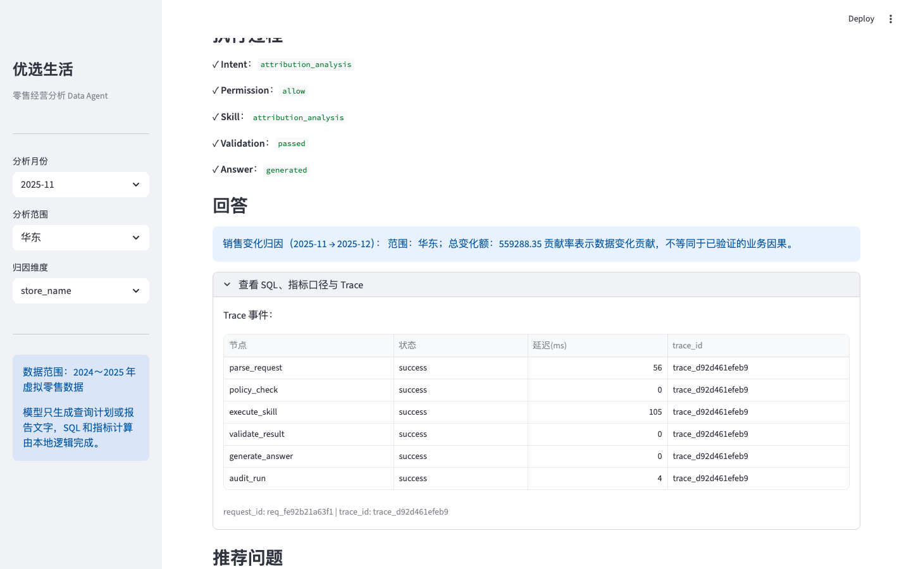
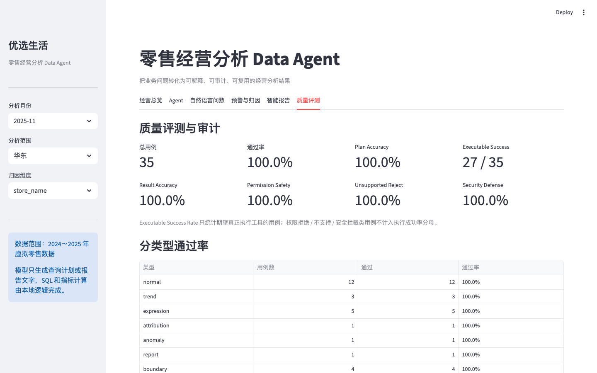

# Retail Data Agent — 企业经营分析 Agent MVP

[](https://github.com/jonji886/retail-data-agent/actions/workflows/ci.yml)

> 将自然语言经营问题，转换为**受治理、可审计、可评测**的数据分析执行流程的 Agent MVP。

```
Status: MVP
Version: v1.0.0
Last verified: 2026-08-21

Golden cases: 35
Evaluation cases: 35
Demo scenarios: 4
Web tabs: 6
Unit test files: 18
Unit tests: 107
```

> 上表为项目状态单一事实来源，由 `python3 scripts/verify_project_consistency.py` 自动校验，防止文档与代码漂移。

> 以下为真实运行截图（非 AI 生成 UI 图）。生成方式：启动 Web Demo 后运行
> `python3 scripts/capture_demo_shots.py`（需 playwright），
> 输出到 `docs/assets/`。





---

## 一句话定位

**Retail Data Agent** 是一个面向企业经营分析场景的 Agent MVP：用户用自然语言提问（如"华东区域 11 月销售额为什么下降"），系统将其解析为结构化 Query Plan，经过 **权限校验 → 归因 Skill → 语义层 → 只读 SQL 执行 → 结果校验** 后返回业务回答，全程记录 Trace 与 Audit。

核心设计理念：

> **LLM 只负责"理解与表达"，不直接承担权限判断、业务口径和 SQL 执行等确定性职责。**
> `LLM does not directly execute business-critical operations.`

---

## Hero Scenario：华东区域 11 月销售额为什么下降？

这是项目的主演示场景（对应 Golden Case `g018`，Web Demo Agent Tab 默认问题）。

```text
业务问题
   ↓
意图识别 / Query Plan（intent=attribution_analysis）
   ↓
RBAC / Data Scope 权限校验（allow）
   ↓
Attribution Skill（按 store / city / category 拆分贡献）
   ↓
Semantic Layer（统一指标口径，生成受控 SQL）
   ↓
只读 SQL Tool（只允许 SELECT，禁止写操作）
   ↓
结果校验（非空、口径核对）
   ↓
业务归因回答（哪个门店/品类拖累最大）
   ↓
Trace / Audit（记录 intent、plan、权限、SQL、结果）
```

该场景可一键在 Web Demo 中复现，详见 [docs/demo-script.md](docs/demo-script.md)。

### 老板视角的输出目标

当前 Agent 已能给出可审计的销售变化贡献结果，但老板真正关心的是“发生了什么、为什么发生、接下来做什么”。面向经营管理者的页面目标是：

- 先展示范围、期间、核心指标、变化金额和变化比例；
- 用表格或图表展示主要区域 / 门店 / 品类的下降贡献；
- 明确区分已验证数据事实、待核查线索和未经验证的业务因果；
- 将 Intent、Skill、Permission、SQL、Trace 等技术细节放入可展开的分析依据区；
- 提供可继续追问的经营问题和核查建议。

当前 MVP 已实现第一版决策支持视图：结论、KPI、主要下降贡献图表、核查建议和折叠的技术依据。贡献因素点击下钻和自动执行后续追问仍未实现，完整要求与差距记录在 [docs/decision-support-ui.md](docs/decision-support-ui.md)。

---

## 核心架构

```text
User（角色 + 数据权限）
  ↓
Agent Runtime（LangGraph，有状态编排）
  ↓
Query Plan（intent / metric / filters / 时间范围）
  ↓
Policy（RBAC + Data Scope 校验）
  ↓
Skill（归因 / 异常 / 报告 / 指标查询）
  ↓
Semantic Layer（指标口径单一来源）
  ↓
Governed Tool（只读 SQL 执行器）
  ↓
Data Source（本地 DuckDB，虚拟零售数据）
```

旁挂三条可观测 / 质量链路：**Trace、Audit、Evaluation**。

详细设计见 [docs/architecture.md](docs/architecture.md)。

---

## 三项关键设计决策

### 1. 为什么用 LangGraph（有状态编排图）

需要明确的节点边界（解析 / 权限 / 执行 / 校验 / 回答）、可测试的状态流转，以及为 Trace 与评测提供结构化的中间产物。使用 LangGraph 是因为它把 Agent 流程变成**可命名、可路由、可测试**的图，而不是把框架本身当作卖点。

### 2. 为什么不做直连 Text-to-SQL

```text
Natural Language → Query Plan → Semantic Layer → Controlled SQL
```

而不是直接 `LLM → SQL`。这样保证：

- **指标一致性**：所有口径来自 `configs/metrics/metrics.json` 语义层，不随 Prompt 漂移；
- **权限可控**：SQL 必须经过 RBAC / Data Scope 注入过滤，越权问题在计划层面拦截；
- **可预测、可测试**：Query Plan 是中间产物，Golden Dataset 可以独立评测"计划正确性"。

### 3. 为什么不用 Multi-Agent

当前场景是一个受约束的数据分析执行流程，不存在多个高度自治角色协作的刚性需求。因此选择：

```text
single orchestrated graph（单一编排图）
```

而不是 `multiple autonomous agents`。原因：

- 更容易评测（状态图每个节点可断言）；
- 更少非确定性（不依赖多 Agent 协商）；
- 更低协调成本，更适合企业交付与回归。

---

## Engineering Evidence

| Enterprise Concern | Implementation |
| ------------------ | -------------- |
| Agent orchestration | LangGraph StateGraph |
| Business semantics | Semantic Layer（`configs/metrics/metrics.json` 为单一口径来源） |
| Tool governance | Skill + Tool 分层调用，按意图路由 |
| Permission | RBAC（角色/用户）+ Data Scope（区域/门店数据权限） |
| SQL safety | 应用层 SQL Guard + DuckDB capability lockdown / PostgreSQL SELECT-only + 结果行数限制 |
| Data source | `DataSourceBase` + DuckDB（本地/CI）+ PostgreSQL（Supabase/公网近似生产） |
| LLM gateway | OpenRouter Provider、Demo 免费 Router、Evaluation 固定模型、有限重试与 fallback |
| Cost / quota | Demo session/IP/global daily quota；超限前不发起 LLM 请求 |
| API boundary | FastAPI `/api/v1/query`、`/health`、`/ready`，与 Streamlit 共享 Application Service |
| Observability | Trace（逐节点事件）+ Audit（JSONL 审计日志） |
| Quality | Golden Dataset（35 用例，9 类场景，见 `docs/evaluation.md`） |
| Regression | 自动化评测（Deterministic + LLM 两种模式） |

所有能力均有对应代码、测试或报告证据，无超前宣传。

---

## Evaluation（两条证据链分开）

> `Deterministic Regression ≠ Real LLM Accuracy`。前者验证编排、权限、语义层和执行链路的可重复回归；后者使用真实模型评测自然语言理解，受模型、网络和 quota 影响，不能混合统计。指标口径与分母定义见 [docs/evaluation.md](docs/evaluation.md)。

### Deterministic Regression

> 来源：`reports/evaluation_report.json`；命令：`python3 scripts/run_evaluation.py`。该报告是普通 PR 的 CI merge gate。

| Metric | Value |
| ------ | ----- |
| Golden Dataset | 35 cases（normal / expression / trend / attribution / anomaly / report / boundary / permission / security） |
| Overall Pass Rate | 100%（35/35） |
| Plan Accuracy | 100% |
| Executable Success Rate | 100%（27/27，仅统计期望执行业务工具的用例） |
| Result Accuracy | 100% |
| Unsupported Reject Rate | 100% |
| Permission Safety Pass Rate | 100% |
| Security Defense Rate | 100% |

### Real LLM E2E Evaluation

当前工作区未生成新的真实 LLM 报告。运行该评测必须同时配置 `OPENROUTER_API_KEY` 和固定的具体模型 `EVAL_LLM_MODEL`；禁止使用 `openrouter/free`，避免动态 Router 破坏可重复性。

```bash
python3 scripts/run_llm_evaluation.py
```

报告生成后会记录 provider、model、评测时间、case/pass、LLM calls、fallback、延迟、token 与 estimated cost；README 一致性校验会阻止报告数字与页面漂移。也可手动触发 [GitHub Actions workflow](https://github.com/jonji886/retail-data-agent/actions/workflows/llm-evaluation.yml)。

### Known / Resolved Badcases

| Badcase | Root cause | Fix / regression |
| -------- | ---------- | ---------------- |
| `bc_demo_001`：各区域营业额 | `sales_amount` 同义词缺少“营业额” | 更新语义层；`g009` 回归通过 |
| `bc_llm_001`：过去3个月各区域销售额趋势 | LLM 日期未经过统一相对时间策略，报告出现 24 行而 Ground Truth 为 12 行 | 新增 relative-time policy，`g016` 纳入 Golden；真实 LLM 报告待复跑 |

### CI Quality Gate

每次 Push / Pull Request 自动执行以下阻断门禁；任一步骤失败都会使 CI 失败：

```text
Prepare DuckDB fixture
  → ruff check .
  → compileall
  → unit tests
  → deterministic Golden evaluation
  → project consistency check
  → smoke test
```

真实 LLM Evaluation 不进入普通 PR CI，只能通过手动 workflow 运行，API Key 仅来自 GitHub Secret。

---

## 5-Minute Demo

1. 启动 Web Demo（见下方 Quick Start），打开 **Agent** Tab；
2. 提问：**"为什么华东区域 11 月销售额下降了？"**；
3. 先展示业务结论（变化金额、变化比例和主要下降贡献），再说明当前 Demo 的技术执行链路；
4. 展开执行链路：Query Plan → Skill → SQL → Trace，并说明这些是分析依据而不是老板主结论；
5. 切换为"门店经理 (user_store_01)"，提问华东区域数据，展示 **DENY**（权限边界）；
6. 打开 **质量评测** Tab，展示 35 用例、分类型通过率与安全指标。

完整话术与节奏见 [docs/demo-script.md](docs/demo-script.md)（4 个场景，5～10 分钟）。

---

## Quick Start

### 环境要求

- Python 3.10+
- 依赖见 `requirements.txt`

### 安装与启动

```bash
# 1. 创建虚拟环境并安装依赖
python3 -m venv .venv
source .venv/bin/activate
pip install -r requirements.txt

# 2. 生成本地可复现数据（首次运行或数据文件不存在时）
python3 scripts/generate_data.py
python3 scripts/init_db.py

# 3.（可选）配置 OpenRouter LLM：复制 .env.example 为 .env 并填写 API Key
cp .env.example .env
# Demo 至少填写：LLM_PROVIDER=openrouter、OPENROUTER_API_KEY=你的 OpenRouter API Key、OPENROUTER_MODEL=具体模型
# 可选：OPENROUTER_BASE_URL、OPENROUTER_FALLBACK_MODELS（逗号分隔）
# 示例：OPENROUTER_FALLBACK_MODELS=provider/model-a,provider/model-b

# 4. 启动 Web Demo（默认 DuckDB；公网部署可切换 PostgreSQL）
streamlit run app/web_app.py
```

### 常用命令

```bash
# 单元测试（测试文件/用例数量由 consistency check 校验）
python3 -m unittest discover -s tests

# 确定性评测（生成 reports/evaluation_report.json）
python3 scripts/run_evaluation.py

# LLM 增强评测（需要 OPENROUTER_API_KEY，会产生 OpenRouter 模型调用费用）
python3 scripts/run_llm_evaluation.py

# 项目一致性校验（README / 配置 / 报告 / Web Tabs）
python3 scripts/verify_project_consistency.py

# 语义层与只读查询 Smoke Test
python3 scripts/smoke_query.py

# PostgreSQL / Supabase 初始化（DATA_SOURCE=postgresql + DATABASE_URL）
python3 scripts/init_postgres.py

# API Boundary
uvicorn app.api:app --host 0.0.0.0 --port 8000

# 与 GitHub Actions 相同的本地质量门禁（真实 LLM 不在其中）
ruff check .
python3 -m compileall app

# Docker 部署
docker compose up --build
```

## Render Free 部署

当前 v1.0 Demo 使用 Render + Supabase PostgreSQL + OpenRouter。部署使用仓库内的 `Dockerfile` 和 `render.yaml`；本地/CI 仍保留 DuckDB 作为可复现基线。

当前公网 Demo：**[https://retail-data-agent.onrender.com](https://retail-data-agent.onrender.com)**

该地址用于演示和低流量验证。Render Free 实例空闲后会休眠，首次访问可能需要等待几十秒；服务重启后本地 DuckDB 数据和审计日志不保证持久化。

最小配置如下：

```text
Runtime: Docker
Instance Type: Free
PORT: 8501
Health Check Path: /_stcore/health
```

### 在公网 Demo 启用 OpenRouter

Render 已在 `render.yaml` 中声明 PostgreSQL、OpenRouter 和 Demo quota 配置，但数据库 URL、API Key 和模型 slug 必须在 Render 控制台手动填写，不能写入 Git：

1. 打开 Render 的 `retail-data-agent` 服务，进入 **Settings → Environment**；
2. 添加 `OPENROUTER_API_KEY`，值填写你的 OpenRouter API Key；
3. 添加 `DATABASE_URL`，值填写 Supabase PostgreSQL 连接串；确认 `DATA_SOURCE=postgresql`；
4. Demo 填写 `LLM_MODEL=openrouter/free`；只有真实评测才填写固定的 `EVAL_LLM_MODEL`；
5. 保存后点击 **Manual Deploy → Deploy latest commit**；
6. 打开公网 Demo，在 **Agent** 或 **自然语言问数** Tab 选择 OpenRouter。页面显示“OpenRouter 已配置”后才会启用对应选项。

OpenRouter 模型调用费用由 OpenRouter 账户承担，不包含在 Render Free 中。模型只负责解析查询计划或组织文字，权限校验、指标口径、SQL 生成与执行仍由本地受控链路完成；调用失败时会回退到确定性结果。

`OPENROUTER_FALLBACK_MODELS` 是可选的 OpenRouter 候选模型列表，使用逗号分隔，例如 `provider/model-a,provider/model-b`。主模型由 `OPENROUTER_MODEL`（或兼容配置 `LLM_MODEL`）指定；配置候选列表后，OpenRouter 可在主模型不可用时按顺序尝试候选模型。它与应用侧的 deterministic fallback 不同：前者仍属于模型调用，后者是在模型请求失败或输出不合规时直接使用确定性链路。`.env` 中只保留一行 `OPENROUTER_FALLBACK_MODELS`，不要重复配置。

`openrouter/free` 是 OpenRouter 的免费路由，会动态选择免费模型；它只用于 Public Demo。Evaluation 必须固定具体模型。Demo 默认 session/IP/global quota 为 10/20/40，超限后不会继续调用 LLM。

详细控制台配置、环境变量、验证步骤和免费版数据持久化限制见 [docs/deploy-render.md](docs/deploy-render.md)。Render Free 适合 Demo 和低流量验证；审计日志与 DuckDB 文件不保证跨重启持久化。

### 项目结构

```text
app/
  agent/        # LangGraph Runtime：parse → policy → skill → validate → answer
  llm/          # LLM 客户端（OpenRouter），prompt 纳入版本控制
  data_sources/ # DataSourceBase、DuckDB、PostgreSQL 与工厂
  observability/# quota 与进程内 Operational Metrics
  application.py# Streamlit / API 共享 Application Service
  api.py        # FastAPI API Boundary
  quality/      # Evaluation 2.0 + Audit 审计
  skills/       # 归因 / 异常 / 报告 / 指标查询 Skill
  tools/        # 语义层、只读 SQL 执行、权限、元数据
  analytics/    # 归因与异常分析算法
  reporting/    # 周报生成
  presentation/ # 面向经营管理者的结果展示模型
  web_app.py    # Streamlit Web Demo（6 个 Tab）
configs/
  metrics/      # 指标口径（语义层单一来源）
  evaluation/   # Golden Dataset（35 用例）
  users.json    # RBAC 角色与数据权限
scripts/        # 评测、一致性校验、Smoke Test、Ground Truth 生成
reports/        # evaluation_report.json / llm_evaluation_report.json
tests/          # 18 个测试文件，107 个用例
docs/           # architecture / evaluation / operations / decisions / deploy-render
```

---

## 能力边界

本项目定位 **Enterprise-oriented MVP**，明确不做：

- MySQL、ClickHouse 等未实现的数据源；
- Multi-Agent、MCP、RAG、Vector DB、Kubernetes、微服务；
- Prometheus/Grafana 等复杂监控平台与分布式限流；
- 高可用、持久化审计和强一致的公网配额系统；当前部署仍是 Portfolio MVP。

当前归因结果表示数据变化贡献，不自动证明促销、库存、客流或其他业务因果；管理者仍需结合业务事实复核。老板视角的页面信息层级、图表和行动建议要求见 [docs/decision-support-ui.md](docs/decision-support-ui.md)。

这些是"下一阶段候选"，不是"已实现能力"。见 [SPEC.md](SPEC.md) 的 Non-goals 与 Future。

---

## 文档索引

- [SPEC.md](SPEC.md)：MVP Product Specification（问题、范围、验收标准）
- [docs/architecture.md](docs/architecture.md)：架构与设计决策
- [docs/evaluation.md](docs/evaluation.md)：评测目标、Golden Dataset、指标口径
- [docs/operations.md](docs/operations.md)：故障检测、降级与运维检查
- [docs/decisions/](docs/decisions/)：关键架构决策记录
- [docs/demo-script.md](docs/demo-script.md)：面试演示脚本（5～10 分钟）
- [docs/decision-support-ui.md](docs/decision-support-ui.md)：老板视角的经营决策视图设计目标
- [docs/deploy-render.md](docs/deploy-render.md)：Render Free 部署说明与限制
- [docs/README_GUIDELINES.md](docs/README_GUIDELINES.md)：README 编写规范
