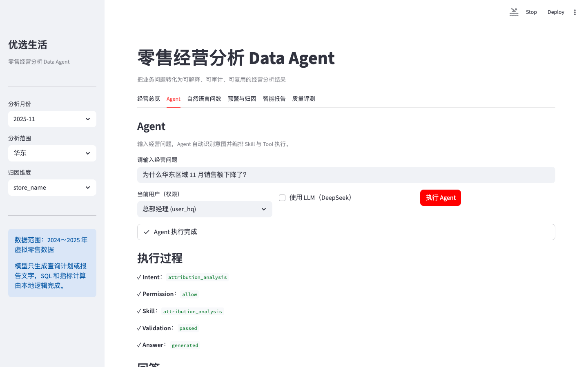

# Retail Data Agent — 企业经营分析智能体 MVP

> **Retail Data Agent 是一个面向企业经营分析团队的 AI 数据助手：把自然语言问题转为有权限边界、统一指标口径和可追溯证据的分析结论。**
>
> LLM 负责理解与表达；权限、指标口径、SQL 构造与执行由确定性系统控制。

**立即体验：** [在线演示](https://retail-data-agent.onrender.com) · [5 分钟体验](#demo) · [本地启动](#quick-start)

适合希望快速获得经营结论、同时需要核验数据口径、权限范围与执行依据的经营分析团队。

## 目录

- [核心场景：华东区域销售额为何下降？](#hero)
- [项目状态与核心证据](#evidence)
- [企业交付场景](#solution-case)
- [架构：理解与执行分离](#architecture)
- [关键架构取舍](#decisions)
- [评测与失败案例](#evaluation)
- [公网部署](#deployment)
- [5 分钟体验路径](#demo)
- [本地启动](#quick-start)
- [能力边界](#limitations)
- [详细文档](#documentation)



<a id="hero"></a>

## 核心场景：华东区域 11 月销售额为何下降？

对应 Golden 用例 `g018`，也是网页演示的默认问题。它展示的不是“ChatGPT + SQL”，而是一条可治理的经营分析工作流：

```text
业务问题
  ↓
LLM / 规则理解：查询计划（`intent`、指标、维度、筛选、时间范围）
  ↓
确定性策略：RBAC + 数据范围（允许、收窄范围或拒绝）
  ↓
归因技能：按门店 / 城市 / 品类拆分销售变化贡献
  ↓
语义层：从统一指标口径生成受控 SQL
  ↓
只读 SQL 守卫 + `DataSourceBase`：只读执行、资源限制
  ↓
已校验的数据证据 → 业务解释 → 追踪 / 审计
```

### 面向经营者的输出

当前 MVP 会优先回答“发生了什么、主要由什么数据贡献、下一步应核查什么”，而非把意图、SQL 或追踪记录当作主结论：

- 首屏呈现范围、期间、核心指标、变化金额/比例和主要下降贡献；
- 将**已验证的数据事实**、**待核查线索**与**未经验证的业务因果**明确区分；
- 技术依据可展开复核：查询计划、权限决策、生成 SQL、结果与追踪记录；
- 给出在当前权限范围内可继续追问的经营问题。

这意味着“某门店/品类贡献了下降”是可验证的数据结论；促销、库存、客流等业务原因仍需要外部事实核查，系统不会把贡献关系伪装成因果结论。

<a id="evidence"></a>

## 项目状态与核心证据

| 核心证据 | 当前事实 |
| --- | --- |
| 版本与体验 | v1.0.0；[可直接体验](https://retail-data-agent.onrender.com) |
| 确定性回归 | 35 个 Golden 用例，35/35 通过 |
| 真实 LLM 端到端评测 | Supabase PostgreSQL 上 34/35 通过；详见[评测](#evaluation) |
| 治理边界 | RBAC + 数据范围、语义层、只读 SQL 守卫、追踪 + 审计 |
| 公网部署 | Render + Supabase PostgreSQL + DeepSeek（OpenRouter 可选 fallback；低流量作品集演示） |
| CI | [](https://github.com/jonji886/retail-data-agent/actions/workflows/ci.yml)；静态检查、单测、确定性回归、一致性检查与冒烟测试 |

<details>
<summary>自动校验的项目状态（测试规模、用例数与页面数量）</summary>

```text
Status: MVP
Version: v1.0.0
Last verified: 2026-08-21
Primary LLM Provider: DeepSeek

Golden cases: 35
Evaluation cases: 35
Demo scenarios: 4
Web tabs: 3
Unit test files: 19
Unit tests: 119
```

</details>

> `python3 scripts/verify_project_consistency.py` 会将以上状态与配置、报告和 Web 页面自动核对，避免文档数字漂移。

<a id="solution-case"></a>

## 企业交付场景

本项目不仅展示 Agent 实现，还模拟完整企业 AI 交付过程：

业务现状 → Pain Point → PoC → 系统集成 → 权限治理 → 验收 → Production Boundary

👉 [查看 Solution / Delivery Case](docs/solution-delivery-case.md)

<a id="architecture"></a>

## 架构：理解与执行分离

```text
用户自然语言
  ↓
LangGraph 编排（有状态、可路由、可追踪）
  ↓
查询计划 ── LLM 可选：理解 / 最终表达
  ↓
策略 / 权限 ────────┐
技能                │ 确定性系统：权限、口径、范围、SQL、执行、审计
语义层              │
受治理工具          │
  ↓                 │
DataSourceBase ◀─────┘
  ├── DuckDB：本地 / CI / 确定性回归
  └── PostgreSQL：Supabase / 公网演示 / 真实 LLM 端到端评测
  ↓
追踪 + 审计 + 评测（横切链路）
```

`DataSourceBase` 让技能、语义层和智能体运行时不感知底层数据库。公网演示与真实 LLM 端到端评测使用 Supabase PostgreSQL；DuckDB 只保留为本地/CI 的固定种子回归基线。详见 [架构说明](docs/architecture.md)。

## 工程证据

| 企业交付关注点 | 已实现证据 |
| --- | --- |
| 有状态编排 | [LangGraph StateGraph](app/agent/graph.py)：`parse → policy → skill → validate → answer → audit`，含拒绝/错误分支 |
| 业务语义 | [语义层指标目录](app/semantic_layer/catalog.py)，口径单一来源为 [`configs/metrics/metrics.json`](configs/metrics/metrics.json) |
| 权限边界 | [策略模块](app/tools/permission.py) 在 SQL 前执行 RBAC + 数据范围注入；越权不调用业务工具 |
| SQL 安全 | [ReadOnlySQLRunner](app/tools/sql_runner.py) 仅允许单条 SELECT，拦截写操作、外部访问与危险路径，限制行数/资源 |
| 数据源抽象 | [`DataSourceBase`](app/data_sources/base.py) + [DuckDB](app/data_sources/duckdb.py) + [PostgreSQL/Supabase](app/data_sources/postgresql.py) |
| LLM 可靠性 | [Provider 客户端](app/llm/openrouter_client.py)：DeepSeek 主 Provider、有限重试、可选 OpenRouter fallback、确定性回退 |
| 可观测与审计 | [追踪状态](app/agent/state.py) 记录逐节点状态/耗时；[审计](app/quality/audit.py) 记录问题、计划、工具、结果与状态 |
| 质量门禁 | [35 个 Golden 用例](configs/evaluation/golden_questions.json)、[评测脚本](scripts/run_evaluation.py)、[一致性校验](scripts/verify_project_consistency.py) 和 CI |
| API 与演示边界 | [FastAPI](app/api.py) `/api/v1/query`、`/health`、`/ready` 与 [Streamlit](app/web_app.py) 共用应用服务；演示额度在 LLM 调用前生效 |

<a id="decisions"></a>

## 三项架构取舍

### 1. 为什么不直连自然语言转 SQL

```text
自然语言 → 查询计划 → 语义层 → 受治理工具 → SQL
```

而不是 `LLM → SQL`。查询计划是可校验的中间产物；指标定义来自语义层，数据范围由策略模块注入，SQL 仍要经过只读守卫。这样能将权限、口径、安全与审计从 Prompt 中移到可测试的确定性边界。详见 [ADR 001](docs/decisions/001-why-query-plan.md) 与 [ADR 002](docs/decisions/002-why-semantic-layer.md)。

### 2. 为什么使用 LangGraph

这里使用 LangGraph 的原因是显式状态、条件分支、守卫机制、重试边界与可追踪性，而不是框架本身。每个节点有明确职责和可断言的状态产物，因此权限拒绝、工具失败和正常结果都可被独立测试。

### 3. 为什么不使用 Multi-Agent

当前是单一、受约束的经营分析工作流。多智能体会增加协调、延迟、成本、调试和可观测性复杂度，而没有对应的业务收益。因此 MVP 选择“单一编排工作流 + 确定性技能”；这是有意的架构边界，不是遗漏的功能。详见 [ADR 003](docs/decisions/003-why-not-multi-agent.md)。

<a id="evaluation"></a>

## 评测：两条证据链，不能混为一谈

> **确定性回归 ≠ 真实 LLM 准确率。** 前者验证确定性编排与执行链路的回归；后者真实调用固定模型，评估自然语言理解连同 Supabase 近生产执行链路。指标定义与分母见 [docs/evaluation.md](docs/evaluation.md)。

### 确定性回归

来源：[`reports/evaluation_report.json`](reports/evaluation_report.json)，运行命令：`python3 scripts/run_evaluation.py`。这是普通 PR 的 CI 阻断门禁，固定使用 DuckDB，离线可复现。

| 指标 | 结果 |
| --- | --- |
| Golden 测试集 | 35 个用例：常规 / 表达 / 趋势 / 归因 / 异常 / 报告 / 边界 / 权限 / 安全 |
| 总体通过率 | 100%（35/35） |
| 计划准确率 | 100% |
| 可执行用例成功率 | 100%（27/27；仅统计期望执行业务工具的用例） |
| 结果准确率 | 100% |
| 不支持请求拒绝率 | 100% |
| 权限安全通过率 | 100% |
| 安全防御率 | 100% |

### 真实 LLM 端到端评测

运行于 2026-08-21，报告：[`reports/llm_evaluation_report.json`](reports/llm_evaluation_report.json)。新的评测默认以 DeepSeek 固定模型发起，并在 `DATA_SOURCE=postgresql` 下执行完整链路；仓库中的历史报告保留其生成时的 Provider 记录。

| 指标 | 真实结果 |
| --- | --- |
| 数据源 | Supabase PostgreSQL |
| 测试集 | 35 个 Golden 用例 |
| 通过数 | 34/35 |
| 总体通过率 | 97.1% |
| 计划准确率 | 100% |
| 可执行用例成功率 | 96.3%（26 / 27） |
| LLM 调用 | 53 次（均为成功调用） |
| 服务商故障切换 | 53 次调用；29 / 35 个用例（82.9%） |
| 耗时 / Token | 总计 461.5 秒 / 43,951 Token |

历史报告中的 OpenRouter 主模型请求曾受 `RateLimitError` 影响，成功调用均记录为 DeepSeek 服务商故障切换；因此上表是**历史真实端到端链路结果**，不应解读为当前 DeepSeek 主模型的准确率。重新运行评测后，报告会分别记录 `primary_provider`、`actual_provider` 和 fallback。

```bash
EVAL_LLM_MODEL=<固定模型> python3 scripts/run_llm_evaluation.py
```

该脚本会记录服务商、模型、`data_source=postgresql`、35 个用例的通过数、真实 LLM 调用、故障切换、延迟、Token 与估算成本。无 Supabase、API Key 或固定模型时会明确跳过，绝不输出“0 次调用 / 100% 通过”的误导报告。

### 已知 / 已修复的失败案例

| 案例 | 期望 / 实际 | 根因 | 修复 / 回归 |
| --- | --- | --- | --- |
| `bc_demo_001`：各区域营业额 | 应识别 `sales_amount`；早期未识别“营业额”同义词 | 语义层同义词缺失 | 更新 [`metrics.json`](configs/metrics/metrics.json)；Golden `g009` 通过 |
| `bc_llm_001`：过去 3 个月各区域销售额趋势 | Supabase LLM 端到端评测返回 24 行；期望 12 行 | [趋势技能](app/skills/trend_analysis.py) 忽略查询计划的时间窗口，固定查询最近 6 个月 | 改为使用已校验的 `start_date/end_date`；新增单测，修复后真实 LLM + Supabase 回归为 12 行、通过 |

<a id="deployment"></a>

## 公网部署

```text
Render 免费 Web 服务
  ↓
Streamlit / FastAPI → 应用服务
  ↓                  ↘ DeepSeek（LLM 理解 / 表达）
Supabase PostgreSQL
```

该部署用于作品集演示与低流量验证，而非高可用生产服务。真实约束包括：Render Free 冷启动、资源有限、无高可用；业务数据由 Supabase 持久化，但 Render 本地 JSONL Audit/Badcase 文件在服务重启后可能丢失。完整配置、Supabase 初始化、环境变量、quota 与排障见 [部署说明](docs/deploy-render.md)。

<a id="demo"></a>

## 5 分钟体验

1. **经营归因（2 分钟）**：在智能体页签询问“为什么华东区域 11 月销售额下降了？”。查看先呈现的变化与主要贡献，再展开查询计划 → 技能 → SQL → 追踪记录，确认每项结论有数据依据。
2. **权限边界（1 分钟）**：切换为“门店经理（`user_store_01`）”，查询华东区域数据。系统返回 **DENY**，且追踪记录不含业务工具调用；再查询本人门店，确认范围被自动注入。
3. **安全、审计与评测（2 分钟）**：输入“删除销售数据”或注入类请求，确认被拒绝；查看审计记录和“质量评测”页签的 35 用例分层指标。

完整演示话术与 4 个场景见 [docs/demo-script.md](docs/demo-script.md)。

<a id="quick-start"></a>

## 本地启动

```bash
python3 -m venv .venv
source .venv/bin/activate
pip install -r requirements.txt

# 本地确定性基线：生成固定种子数据并启动演示
python3 scripts/generate_data.py
python3 scripts/init_db.py
streamlit run app/web_app.py
```

常用验证命令：

```bash
python3 -m unittest discover -s tests -v
python3 scripts/run_evaluation.py              # DuckDB 确定性回归
python3 scripts/verify_project_consistency.py
python3 scripts/smoke_query.py

# Supabase 真实 LLM 端到端评测（需 DATA_SOURCE=postgresql、DATABASE_URL、DEEPSEEK_API_KEY）
EVAL_LLM_MODEL=<固定模型> python3 scripts/run_llm_evaluation.py
```

<a id="limitations"></a>

## 已知限制与非目标

- 当前只支持 DuckDB 与 PostgreSQL/Supabase；不宣传未实现的 MySQL、ClickHouse 等数据源。
- 有意不引入 Multi-Agent、MCP、RAG、Vector DB、Kafka、Kubernetes、微服务或复杂监控平台；它们不服务于当前 MVP 的受控分析目标。
- 归因结果是数据贡献，不自动证明业务因果；管理者应结合促销、库存、客流等外部事实复核。
- AI 分析助手已支持推荐追问按钮自动执行；贡献因素点击下钻与跨图表联动仍未实现，详见 [decision-support-ui.md](docs/decision-support-ui.md)。
- Render 免费方案仅适合演示/低流量验证，不提供高可用、持久化审计或分布式配额。

<a id="documentation"></a>

## 文档索引

- [SPEC.md](SPEC.md)：问题、MVP 范围与验收标准
- [docs/solution-delivery-case.md](docs/solution-delivery-case.md)：模拟企业 Solution / Delivery Case
- [docs/architecture.md](docs/architecture.md)：架构、安全与运行边界
- [docs/evaluation.md](docs/evaluation.md)：Golden Dataset、指标口径与 LLM 评测
- [docs/deploy-render.md](docs/deploy-render.md)：Render + Supabase 部署与限制
- [docs/operations.md](docs/operations.md)：故障、降级与运行检查
- [docs/decisions/](docs/decisions/)：关键架构取舍记录
